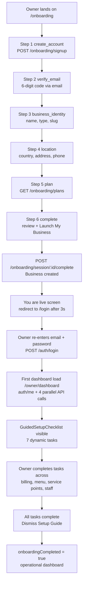

# QuickServe Owner Dashboard — UX & Architecture Audit (READ-ONLY)

Scope: audit/planning only. No code modified. Backend repo: `Quickserve-be`. Frontend repo: `../Quick-serve-qr-menu`.
Every factual claim cites file path + function/component + line number where practical.

---

## A. Owner Journey Map (Signup → Operational)

### Flow (as implemented today)

### Journey facts

| Step | Frontend | Backend |
|---|---|---|
| Wizard shell | [`app/onboarding/page.tsx`](../Quick-serve-qr-menu/app/onboarding/page.tsx:14) renders 6 steps via [`useOnboarding()`](../Quick-serve-qr-menu/hooks/use-onboarding.ts:48) | [`onboarding-route.js`](src/routes/onboarding-route.js:14) mounts `signup`, `verify-email`, `session/:id`, `session/:id/complete`, `plans` |
| Session persistence | sessionId stored in localStorage `qs_onboarding_session` ([`use-onboarding.ts:46`](../Quick-serve-qr-menu/hooks/use-onboarding.ts:46)), resume on mount ([`resumeSession()`](../Quick-serve-qr-menu/hooks/use-onboarding.ts:81)) | [`OnboardingSession`](src/models/OnboardingSession.js:24) auto-expires after 7 days ([line 45](src/models/OnboardingSession.js:45)), unique per email ([line 49](src/models/OnboardingSession.js:49)) |
| Business creation | [`CompleteStep.tsx`](../Quick-serve-qr-menu/components/onboarding/steps/CompleteStep.tsx:79) `handleLaunch()` | [`completeOnboarding()`](src/controllers/onboardingController.js:286) creates Business with `onboardingCompleted: false` ([line 396](src/controllers/onboardingController.js:396)) and all-false `setupChecklist` ([lines 401–411](src/controllers/onboardingController.js:401)) |
| Post-creation | "You're live!" then `router.push("/login")` after 3s ([`CompleteStep.tsx:83–85`](../Quick-serve-qr-menu/components/onboarding/steps/CompleteStep.tsx:83)) | OnboardingSession deleted ([line 418](src/controllers/onboardingController.js:418)) |
| Auth | [`useAuthGuard()`](../Quick-serve-qr-menu/hooks/use-auth-guard.ts:37) calls `GET /auth/me` on every owner page mount | [`loginUser()`](src/controllers/authController.js:181) regenerates Redis-backed session ([`session.js`](src/config/session.js:5), 8h rolling cookie) |
| First dashboard | [`app/owner/dashboard/page.tsx`](../Quick-serve-qr-menu/app/owner/dashboard/page.tsx:168) fires 4 parallel requests | [`getDashboardData()`](src/controllers/ownerController.js:294), [`getSettings()`](src/controllers/businessController.js:60), [`getTableSessionsOverview()`](src/controllers/ownerController.js:235), [`getSetupProgress()`](src/controllers/setupProgressController.js:139) |

### Journey breaks found

1. **Forced re-login after signup.** Completion redirects to `/login` ([`CompleteStep.tsx:83–85`](../Quick-serve-qr-menu/components/onboarding/steps/CompleteStep.tsx:83)); the backend already has the password hash and could establish a session at `completeOnboarding`, but does not.
2. **"You're live!" is misleading.** At creation the business has no menu, no service points, no payments — it cannot accept a single order.
3. **Contradictory tracking fields.** `completeOnboarding` sets `onboardingCompleted: false` **and** `onboardingCompletedAt: new Date()` simultaneously ([`onboardingController.js:396–398`](src/controllers/onboardingController.js:396)).
4. **Two parallel setup systems.** Persisted `setupChecklist` (9 flags, [`Business.js:283–293`](src/models/Business.js:283)) with controllers [`getSetupChecklist()`/`updateSetupChecklist()`](src/controllers/ownerController.js:575) — **never registered in any route** (dead code) — vs. the live dynamic [`setupProgressController.js`](src/controllers/setupProgressController.js:54) used by the dashboard.
5. **Dead route directory.** `app/owner/getting-started/` exists but is empty (no `page.tsx`) — an abandoned post-signup landing intent.

---

## B. Current Onboarding Flow Audit

| Step | Inputs collected | Backend write | Required? | Skippable? |
|---|---|---|---|---|
| create_account | firstName, lastName, email, password, termsAccepted | Upserts `OnboardingSession`, sends 6-digit code, TTL 30 min ([`VERIFICATION_CODE_TTL_MS`](src/controllers/onboardingController.js:12)) | All required ([line 56](src/controllers/onboardingController.js:56)) | No |
| verify_email | email + 6-digit token | `emailVerified = true`, `currentStep = 'business_identity'` ([lines 187–190](src/controllers/onboardingController.js:187)) | Required | No |
| business_identity | name, displayName, businessType, slug | `PATCH /onboarding/session/:id` merges `businessData` ([`updateSession()`](src/controllers/onboardingController.js:231)); early slug uniqueness check per country ([lines 254–268](src/controllers/onboardingController.js:254)) | Required at completion | No |
| location | country, address, phoneNumber, contactEmail | same PATCH merge; country resolved via [`resolveCountryMetadata()`](src/utils/countryHelper.js) | Required at completion ([`getMissingBusinessFields()`](src/controllers/onboardingController.js:34)) | No |
| plan | plan slug / planId | validated against `Plan` collection at completion ([lines 331–348](src/controllers/onboardingController.js:331)); defaults to `basic` ([line 348](src/controllers/onboardingController.js:348)) | Optional (defaults basic) | Effectively yes |
| complete | review only | `Business.create(...)` ([lines 367–415](src/controllers/onboardingController.js:367)) | — | No |

**Validation quality:** good — email availability checks ([`assertEmailAvailable`](src/controllers/onboardingController.js:66)), slug regex + per-country uniqueness ([`Business.js:86–95, 305`](src/models/Business.js:86)), country metadata validation ([line 317](src/controllers/onboardingController.js:317)).

**Critical gap:** onboarding collects **identity only**. Nothing operational (hours, menu, service points, payments, staff) is captured. `businessType` defaults silently to `restaurant` if absent ([line 366](src/controllers/onboardingController.js:366)). Therefore **onboarding completion ≠ operational**; the gap is bridged only by the dashboard setup checklist.

**Code smells:** duplicate object key `businessId, businessId: businessId` in `Business.create` ([lines 368–369](src/controllers/onboardingController.js:368)); duplicate `servicePointLabel: 1` projection key ([`ownerController.js:325`](src/controllers/ownerController.js:325)); duplicate keys in login responses ([`authController.js:227–228`](src/controllers/authController.js:227)).

---

## C. Setup Progress Implementation Audit

Implementation: [`setupProgressController.js`](src/controllers/setupProgressController.js) (single file, 199 lines).

- **Endpoint:** `GET /owner/setup-progress` ([`owner-route.js:127`](src/routes/owner-route.js:127)) → [`getSetupProgress()`](src/controllers/setupProgressController.js:139).
- **Computation:** fully **dynamic, recomputed on every request** by [`getSetupProgressData()`](src/controllers/setupProgressController.js:108): 1× `Business.findOne` + 4× `countDocuments` in parallel (MenuItem, ServicePoint, Staff, Order — [lines 114–124](src/controllers/setupProgressController.js:114)). **Nothing persisted, nothing cached.**
- **Tasks** ([`buildSetupProgressResponse()`](src/controllers/setupProgressController.js:54), lines 58–67):
  1. `stripeConnected` — `stripeOnboardingComplete || (chargesEnabled && payoutsEnabled)`
  2. `billingCardAdded` — `defaultPaymentMethodId` present
  3. `menuItemAdded` — MenuItem count > 0
  4. `servicePointCreated` — ServicePoint count > 0
  5. `brandingConfigured` — plan-gated to growth/pro ([`BRANDING_PLANS`](src/controllers/setupProgressController.js:7)); locked card with "Upgrade Plan" CTA ([lines 91–96](src/controllers/setupProgressController.js:91))
  6. `staffInvited` — Staff count > 0 (excluding disabled)
  7. `firstOrderPlaced` — Order count > 0
- **Dismissal:** `POST /owner/setup-progress/dismiss` (primary owner only, [`owner-route.js:128`](src/routes/owner-route.js:128)) is **rejected until 100% complete** ([lines 170–175](src/controllers/setupProgressController.js:170)); on dismiss it sets `setupProgress.setupGuideDismissed`, `onboardingCompleted: true` ([lines 177–187](src/controllers/setupProgressController.js:177)).
- **Frontend:** [`GuidedSetupChecklist.tsx`](../Quick-serve-qr-menu/components/owner/GuidedSetupChecklist.tsx:58) renders a static `TASKS` array with deep links (`/owner/billing?tab=payouts`, `/owner/menu?create=1`, `/owner/service-points?create=1`, `/owner/staff?create=1`). Progress ring + bar; collapsible; "ready" celebration card when complete ([lines 128–149](../Quick-serve-qr-menu/components/owner/GuidedSetupChecklist.tsx:128)).

### Deficiencies

1. **Not business-type aware.** Hotels (lodging module, no foodService) still get "Add your first menu item"; there is no room-type/pricing/check-in task for hotels. Capabilities exist ([`resolveBusinessCapabilities()`](src/services/businessCapabilityService.js:119)) but setup-progress ignores `businessType`/`modules` entirely.
2. **`firstOrderPlaced` conflates setup with operations** — the guide cannot be dismissed until a real order exists, which depends on customers, not the owner.
3. **Missing real readiness items:** operating hours, QR code printed/available, reservations configuration, hotel room metadata (price/night, images), payment preferences.
4. **No "why" or sequencing** — flat 2-column grid, no next-best-action, no dependency order, no per-task effort hints.
5. **Recomputed constantly:** dashboard loads it on mount, every 60s poll, and on window focus ([`dashboard/page.tsx:176,194–209`](../Quick-serve-qr-menu/app/owner/dashboard/page.tsx:176)) → 4 countDocuments each time.
6. **No live updates:** completing a task in another tab/screen is only visible on next poll/refetch. No SSE event exists for setup progress.
7. **Stale definitions risk:** task definitions live only in backend code; frontend duplicates titles/links in `TASKS` — drift-prone.

---

## D. Real "Ready to Operate" Requirements (by business type)

Derived strictly from existing functionality. Classification: **Required** (feature cannot work), **Recommended** (works but degraded), **Optional**.

### Restaurant / Bar (`businessType: restaurant | bar_lounge`, module `foodService` — [`businessCapabilityService.js:8–12`](src/services/businessCapabilityService.js:8))

| Requirement | Evidence | Class |
|---|---|---|
| Business profile (name, address, phone, contact email, currency, timezone) | [`Business.js:84–101`](src/models/Business.js:84); collected at onboarding | Required (done at signup) |
| ≥1 ServicePoint of type `table` | QR guest flow is keyed by servicePointId ([`ServicePoint.js:27–39`](src/models/ServicePoint.js:27)); guest pages `q/[businessId]/[servicePointId]` | Required |
| QR code printed/available | print page `app/owner/service-points/[id]/print/page.tsx` | Required |
| ≥1 menu item (with category) | guest menu pages; `menuItem` model; default categories ([`Business.js:134–137`](src/models/Business.js:134)) | Required |
| Payments: Stripe Connect (`stripeChargesEnabled`) **or** offline billing active + card | online: [`ownerController.js:375`](src/controllers/ownerController.js:375); offline availability = `billingStatus==='active' && defaultPaymentMethodId` ([`businessController.js:76–80`](src/controllers/businessController.js:76)) | Required (at least one channel) |
| Operating hours | [`Business.operatingHours`](src/models/Business.js:269), [`utils/operatingHours.js`](src/utils/operatingHours.js) | Recommended |
| Ordering preferences (dine-in/takeout/QR/waiter ordering) | [`OrderingPreferencesSchema`](src/models/Business.js:25) | Recommended |
| Staff (waiter/kitchen) | staff login powers kitchen/waitstaff dashboards; waiter ordering fallback ([`enableWaiterOrdering`](src/models/Business.js:32)) | Recommended |
| Reservations enabled + reservable service points | [`settings.reservationsEnabled`](src/models/Business.js:230), [`ServicePoint.reservable`](src/models/ServicePoint.js:85) | Optional |
| Feedback, tips, branding | [`settings.tipsEnabled`](src/models/Business.js:242), branding plan-gated ([`updateBranding()`](src/controllers/ownerController.js:546)) | Optional |

### Hotel (`businessType: hotel`, module `lodging`)

| Requirement | Evidence | Class |
|---|---|---|
| ≥1 ServicePoint of type `room` with `roomType` | [`ServicePoint.js:59–69`](src/models/ServicePoint.js:59); capability restricts hotels to `room` type ([`businessCapabilityService.js:131–133`](src/services/businessCapabilityService.js:131)) | Required |
| Room pricing & capacity (`pricePerNight`, `maxGuests`, beds) | [`ServicePoint.js:92–99`](src/models/ServicePoint.js:92); used by available-rooms endpoint consumed in [`HotelReservationFlow.tsx:807`](../Quick-serve-qr-menu/components/reservations/hotel/HotelReservationFlow.tsx:807) | Required |
| Room types configured | [`Business.hotelRoomTypes`](src/models/Business.js:138) + defaults ([`hotelConstants.js:1–10`](src/constants/hotelConstants.js:1)); add/remove via `/business/room-types` ([`business-route.js:205–206`](src/routes/business-route.js:205)) | Required (defaults pre-seeded) |
| Payments for reservation deposits | reservation payment flow ([`paymentController.js:427–438`](src/controllers/paymentController.js:427)) | Required |
| Check-in/check-out times | [`HotelSettingsSchema`](src/models/Business.js:47); check-in code flow ([`checkInHotelReservation`](src/routes/owner-route.js:637)) | Recommended (defaults 15:00/11:00) |
| Room images & amenities | [`ServicePoint.js:101–102`](src/models/ServicePoint.js:101) | Recommended |
| Staff | same as above | Recommended |
| Food service module add-on | [`updateOwnerBusinessModules`](src/routes/business-route.js:52); hotel nav gains orders/menu ([`businessCapabilityService.js:108–114`](src/services/businessCapabilityService.js:108)) | Optional |

**Conclusion:** the current 7-task checklist covers roughly half of the restaurant requirements and almost none of the hotel-specific ones.

---

## E. Dashboard Component/Data Map

Page: [`app/owner/dashboard/page.tsx`](../Quick-serve-qr-menu/app/owner/dashboard/page.tsx:157) (`OwnerCommandCenter`), wrapped by [`app/owner/layout.tsx`](../Quick-serve-qr-menu/app/owner/layout.tsx:352) (sidebar shell + `BusinessProvider`).

| Section (render order) | Data source | Refresh behavior |
|---|---|---|
| Sticky header + manual refresh button ([line 250](../Quick-serve-qr-menu/app/owner/dashboard/page.tsx:250)) | — | button → `fetchData()` |
| Welcome banner + active-orders chip ([line 270](../Quick-serve-qr-menu/app/owner/dashboard/page.tsx:270)) | `snapshot.activeOrders` | 60s poll |
| GuidedSetupChecklist ([line 287](../Quick-serve-qr-menu/app/owner/dashboard/page.tsx:287)) | `GET /owner/setup-progress` | 60s poll + focus |
| Today's Snapshot — 4 KPI cards ([line 297](../Quick-serve-qr-menu/app/owner/dashboard/page.tsx:297)) | `snapshot` | 60s poll |
| Business Health — payments/billing/staff badges ([line 332](../Quick-serve-qr-menu/app/owner/dashboard/page.tsx:332)) | `businessHealth` | 60s poll |
| Live Operations — actionItems list ([line 367](../Quick-serve-qr-menu/app/owner/dashboard/page.tsx:367)) | `actionItems` | 60s poll |
| Reconciliation card ([line 397](../Quick-serve-qr-menu/app/owner/dashboard/page.tsx:397)) | `reconciliationCount` | 60s poll |
| Live Session Overview ([line 417](../Quick-serve-qr-menu/app/owner/dashboard/page.tsx:417)) | `GET /owner/table-sessions/overview` | 60s poll + own Refresh button |
| Revenue Today chart + Recent Activity ([line 475](../Quick-serve-qr-menu/app/owner/dashboard/page.tsx:475)) | `hourlyRevenue`, `activityFeed` | 60s poll |
| Recent Feedback preview ([line 552](../Quick-serve-qr-menu/app/owner/dashboard/page.tsx:552)) | `feedbackPreview` | 60s poll |
| Quick Actions — 6 static links ([line 588](../Quick-serve-qr-menu/app/owner/dashboard/page.tsx:588)) | none | static |

Fetch orchestration: single [`fetchData()`](../Quick-serve-qr-menu/app/owner/dashboard/page.tsx:168) with `Promise.all` of 4 requests ([lines 172–177](../Quick-serve-qr-menu/app/owner/dashboard/page.tsx:172)); `setInterval(fetchData, 60_000)` ([lines 194–198](../Quick-serve-qr-menu/app/owner/dashboard/page.tsx:194)); refetch on window `focus` ([lines 200–209](../Quick-serve-qr-menu/app/owner/dashboard/page.tsx:200)). **No SSE on this page.**

Layout/nav: navigation groups come from capabilities ([`resolveNavigationGroups()`](../Quick-serve-qr-menu/app/owner/layout.tsx:67), backend [`buildNavigation()`](src/services/businessCapabilityService.js:101)); mobile uses a Sheet sidebar ([lines 382–406](../Quick-serve-qr-menu/app/owner/layout.tsx:382)).

Other owner screens & their data (from API-call grep):
- Orders [`app/owner/orders/page.tsx:92`](../Quick-serve-qr-menu/app/owner/orders/page.tsx:92) — settings + `/owner/orders`
- Transactions [`app/owner/transactions/page.tsx:88`](../Quick-serve-qr-menu/app/owner/transactions/page.tsx:88)
- Menu [`app/owner/menu/page.tsx:127–152`](../Quick-serve-qr-menu/app/owner/menu/page.tsx:127) — categories + settings + menu-items (3 calls)
- Service points [`app/owner/service-points/page.tsx:130–155`](../Quick-serve-qr-menu/app/owner/service-points/page.tsx:130) — settings + service-points + sessions overview (3 calls)
- Staff [`app/owner/staff/page.tsx:175`](../Quick-serve-qr-menu/app/owner/staff/page.tsx:175)
- Billing [`app/owner/billing/page.tsx:142–148`](../Quick-serve-qr-menu/app/owner/billing/page.tsx:142) — **6 parallel calls** incl. `/owner/orders` just to count tips
- Settings [`app/owner/settings/page.tsx:312`](../Quick-serve-qr-menu/app/owner/settings/page.tsx:312)
- Branding [`app/owner/branding/page.tsx:57`](../Quick-serve-qr-menu/app/owner/branding/page.tsx:57)
- Guests [`app/owner/guests/page.tsx:71–93`](../Quick-serve-qr-menu/app/owner/guests/page.tsx:71)
- Feedback [`app/owner/feedback/page.tsx:70`](../Quick-serve-qr-menu/app/owner/feedback/page.tsx:70)
- Analytics [`use-owner-analytics.ts:75`](../Quick-serve-qr-menu/hooks/use-owner-analytics.ts:75) — `/owner/analytics` with 60s polling + abort/sequence guards
- Reservations [`useReservationDashboard.ts:218–222`](../Quick-serve-qr-menu/components/reservations/dashboard/useReservationDashboard.ts:218) — 3 parallel calls + **SSE** ([lines 199–209](../Quick-serve-qr-menu/components/reservations/dashboard/useReservationDashboard.ts:199))

---

## F. Dashboard API → Backend Query Map

| Endpoint | Controller | Mongo operations per call |
|---|---|---|
| `GET /owner/dashboard` | [`getDashboardData()`](src/controllers/ownerController.js:294) | `ServiceRequest.updateMany` **write on GET** to expire stale calls ([lines 306–309](src/controllers/ownerController.js:306)); then 8 parallel ops: `Order.find` today, `Business.findOne` **full document, no projection** ([line 327](src/controllers/ownerController.js:327)), `Feedback.find` limit 5, `Staff.find` active, 2× `ServiceRequest.find`, `MenuItem.countDocuments`, `Order.countDocuments` reconciliation ([lines 312–350](src/controllers/ownerController.js:312)) |
| `GET /business/settings` | [`getSettings()`](src/controllers/businessController.js:60) | `Business.findOne` (safe projection) + `Plan.findOne` **every call** ([line 85](src/controllers/businessController.js:85)) |
| `GET /owner/table-sessions/overview` | [`getTableSessionsOverview()`](src/controllers/ownerController.js:235) | `GuestSession.aggregate` + `ServicePoint.find` |
| `GET /owner/setup-progress` | [`getSetupProgressData()`](src/controllers/setupProgressController.js:108) | `Business.findOne` + 4× `countDocuments` |
| `GET /auth/me` (layout, every page) | [`getMe()`](src/controllers/authController.js:338) | `Business.findOne` (owner) or `Staff.findOne` + `Business.findOne` ([lines 348–368](src/controllers/authController.js:348)) |
| `GET /owner/analytics` | [`ownerAnalytics()`](src/controllers/ownerAnalyticsController.js:10) → [`ownerAnalyticsService`](src/services/analytics/ownerAnalyticsService.js) | range-based aggregations (foodService/lodging/shared services) |
| `GET /owner/orders` | [`ownerOrders()`](src/controllers/ownerController.js:32) | `Order.find` + separate `Order.aggregate` for status counts ([lines 158–161](src/controllers/ownerController.js:158)) |
| `GET /owner/transactions` | [`ownerTransactions()`](src/controllers/ownerController.js:646) → [`readOwnerTransactions()`](src/services/transactionReadService.js) | unified orders+reservations read model |

**Initial dashboard load cost:** `/auth/me` + 4 endpoints ≈ **5 HTTP requests → ~16 Mongo operations**, repeated every 60s and on every focus.

Other findings:
- `BUSINESS_TZ` is a **global env var** (`Europe/Malta` default, [`ownerController.js:11`](src/controllers/ownerController.js:11)) — per-business `timezone` ([`Business.js:100`](src/models/Business.js:100)) is ignored for day rollover; multi-country tenants get wrong "today" boundaries.
- `hasMenu = true // Placeholder` ([line 377](src/controllers/ownerController.js:377)) — dead intent.
- `Business.findOne` without projection pulls `ownerPasswordHash` into memory (not returned to client, but unnecessary).

---

## G. Duplicate / Heavy Fetching Findings

1. **`/business/settings` fetched independently by ~10 screens** — dashboard ([174](../Quick-serve-qr-menu/app/owner/dashboard/page.tsx:174)), orders ([92](../Quick-serve-qr-menu/app/owner/orders/page.tsx:92)), transactions ([88](../Quick-serve-qr-menu/app/owner/transactions/page.tsx:88)), guests ([71](../Quick-serve-qr-menu/app/owner/guests/page.tsx:71)), service-points ([131](../Quick-serve-qr-menu/app/owner/service-points/page.tsx:131)), print ([31](../Quick-serve-qr-menu/app/owner/service-points/[id]/print/page.tsx:31)), menu ([139](../Quick-serve-qr-menu/app/owner/menu/page.tsx:139)), billing ([175](../Quick-serve-qr-menu/app/owner/billing/page.tsx:175)), settings ([312](../Quick-serve-qr-menu/app/owner/settings/page.tsx:312)), reservations hook ([220](../Quick-serve-qr-menu/components/reservations/dashboard/useReservationDashboard.ts:220)). Every navigation = fresh `Business.findOne` + `Plan.findOne`. No shared client cache.
2. **Business document fetched ≥4× on one dashboard load:** `/auth/me`, `/business/settings`, `/owner/dashboard` ([line 327](src/controllers/ownerController.js:327)), `/owner/setup-progress` ([line 109](src/controllers/setupProgressController.js:109)).
3. **Setup progress recomputed on every poll** (4 countDocuments) even though it changes only on mutations.
4. **Billing page fires 6 parallel requests** ([billing/page.tsx:142–148](../Quick-serve-qr-menu/app/owner/billing/page.tsx:142)) including a full `/owner/orders` fetch used only to sum tips.
5. **`ownerOrders` double-scans** today's orders: `Order.find` + separate aggregation for counts ([ownerController.js:158](src/controllers/ownerController.js:158)) — could be one `$facet`.
6. **60s full-page polling** re-runs everything including static-ish data (menu item count, branding) — no per-dataset freshness policy.
7. All owner pages pass `?businessId=` query params that the backend **ignores** (session-derived) — harmless but misleading; see Q.

---

## H. Existing Caching Architecture

| Layer | What exists | Used for |
|---|---|---|
| Redis (ioredis) | [`redisClient.js`](src/config/redisClient.js:39) pub/sub pair; [`sessionRedisClient.js`](src/config/sessionRedisClient.js); [`bullmqConnection.js`](src/config/bullmqConnection.js) | SSE fan-out channel `quickserve:events` ([line 42](src/config/redisClient.js:42)); session store `qs:sess:` ([`session.js:6–9`](src/config/session.js:6)); BullMQ queues (email, billing, reservations, post-payment) |
| In-memory | SSE client `Set` per instance ([`sseManager.js:42`](src/utils/sseManager.js:42)) | nothing else |
| HTTP/browser | SSE `Cache-Control: no-cache` ([`sseManager.js:102`](src/utils/sseManager.js:102)) | no cache headers on JSON APIs |
| Frontend | **No React Query / SWR** (absent from [`package.json`](../Quick-serve-qr-menu/package.json:12)); zustand present but only for the customer cart ([`store/cart-store.ts`](../Quick-serve-qr-menu/store/cart-store.ts)); axios with no interceptors ([`axios-config.ts`](../Quick-serve-qr-menu/lib/axios-config.ts:6)) | — |
| Next.js | All owner pages are `"use client"` + axios → **no RSC/server-side fetch caching** | — |

**Verdict:** outside sessions/queues/SSE, there is **no caching layer anywhere**. Every read hits MongoDB.

---

## I. Cache Candidates + Invalidation Strategy (conceptual)

| Class | Datasets | Suggested treatment | Invalidation |
|---|---|---|---|
| A — realtime, never cache | active orders, waiter calls, table sessions, actionItems, live reservation list | keep direct reads / SSE-driven refetch | — |
| B — short TTL ≈ 30–60s | dashboard snapshot KPIs, hourly revenue, setup-progress counts, feedback preview | backend Redis or frontend stale-while-revalidate | TTL expiry is sufficient |
| C — long TTL ≈ 5–15 min | `/business/settings` payload, `/auth/me` capabilities, plans catalog, menu categories, service-point list | frontend shared query cache (per session) and/or Redis keyed `settings:{businessId}` | mutation hooks below |
| D — mutation-invalidated | everything in C | invalidate on: `PATCH /business/settings*` ([business-route.js:46–128](src/routes/business-route.js:46)), menu/service-point/staff CRUD ([owner-route.js:193–525](src/routes/owner-route.js:193)), plan change ([`updatePlan`](src/routes/owner-route.js:833)), Stripe webhook flag updates ([webhookController.js](src/controllers/webhookController.js)), branding PATCH ([owner-route.js:97](src/routes/owner-route.js:97)) | optional SSE `business_updated` event for cross-tab freshness |

**Rules:** every future cache key MUST embed `businessId` (tenant isolation); never cache guest PII in long-TTL tiers; prefer client-side dedupe first (biggest win, zero consistency risk) before server-side Redis caching.

---

## J. Existing SSE Architecture

- **Endpoint:** `GET /events` ([`sse-route.js:22`](src/routes/sse-route.js:22)) → [`sseHandler()`](src/utils/sseManager.js:59).
- **AuthN/Z:** guest roles (`table/anon/customer`) require a `GuestSession` token scoped to businessId ([lines 70–80](src/utils/sseManager.js:70)); staff roles require session cookie + businessId match ([lines 82–88](src/utils/sseManager.js:82)); channel **pinned by session role** via [`SSE_CHANNELS_BY_ROLE`](src/utils/sseManager.js:28) — anti-spoofing ([lines 90–98](src/utils/sseManager.js:90)). Owners/co-owners/managers may subscribe to `kitchen|bar|waiter|reservations`.
- **Delivery:** [`broadcastLocal()`](src/utils/sseManager.js:141) enforces strict `businessId` equality ([line 163](src/utils/sseManager.js:163)), optional role `targets`, per-table scoping for guests ([lines 168–174](src/utils/sseManager.js:168)). Heartbeat every 25s ([lines 117–125](src/utils/sseManager.js:117)).
- **Multi-instance:** [`publishEvent()`](src/utils/sseManager.js:207) → Redis channel `quickserve:events` → [`startRealtimeBus()`](src/utils/realtimeBus.js:12) on every instance; graceful local fallback when Redis absent ([lines 210–226](src/utils/sseManager.js:210)).
- **Events emitted today:** `order_created` / `order_updated` ([orderController.js:362–373,510,646,940](src/controllers/orderController.js:362); [waitstaffOrdersController.js:703–768](src/controllers/waitstaffOrdersController.js:703); [kitchenController.js:157–168](src/controllers/kitchenController.js:157); [webhookController.js:856,1023–1026](src/controllers/webhookController.js:856)), `waiter_call_created` / `waiter_call_updated` ([serviceRequestController.js:211,331,408](src/controllers/serviceRequestController.js:211)), `reservation_arrived` ([reservationArrivalService.js:438](src/services/reservationArrivalService.js:438); [reservationController.js:401](src/controllers/reservationController.js:401)), `reservation_cancelled_by_guest` ([reservationNotComingService.js:192](src/services/reservationNotComingService.js:192)).
- **Frontend consumers:** kitchen ([app/kitchen/page.tsx:70](../Quick-serve-qr-menu/app/kitchen/page.tsx:70)), bar ([app/bar/page.tsx:61](../Quick-serve-qr-menu/app/bar/page.tsx:61)), waitstaff ([app/waitstaff/page.tsx:153](../Quick-serve-qr-menu/app/waitstaff/page.tsx:153)), customer status/order-history/ETA/waitstaff-request pages, and **one owner surface**: the reservations dashboard ([useReservationDashboard.ts:199](../Quick-serve-qr-menu/components/reservations/dashboard/useReservationDashboard.ts:199), role=reservations, refetch on reconnect).
- **Reusable hook:** [`useEventSource()`](../Quick-serve-qr-menu/hooks/use-event-source.ts:9) already handles reconnect + visibility-change refetch.

---

## K. Owner-Dashboard Realtime Opportunities (minimum meaningful scope)

The owner dashboard **polls at 60s for data that is already event-driven elsewhere**. Recommended scope, reusing existing events — no new infra:

| Dashboard element | Event(s) to subscribe | Effect |
|---|---|---|
| Active orders KPI, activity feed, "orders waiting >15min" action item | `order_created`, `order_updated` (owner role already permitted on waiter/kitchen/bar channels) | incremental refetch of `/owner/dashboard` (or optimistic count bump) instead of waiting for poll |
| Waiter-call action items | `waiter_call_created`, `waiter_call_updated` | immediate visibility of pending/missed calls |
| Reservations card (if added to dashboard) | `reservation_arrived`, `reservation_cancelled_by_guest` | same pattern as existing reservations dashboard |
| Live session overview | keep short poll (guest sessions have no events today) | do NOT add SSE here yet |

**Do NOT propose SSE for:** analytics (historical ranges), settings/branding (config), setup progress (mutation-response driven — see below). Debounce: coalesce bursts (e.g., webhook replays) with a ~2–3s trailing refetch.

---

## L. Proposed Guided Setup Experience (design)

Replace the flat checklist with a **state-machine guide** that always answers: *what next, why, where, how much remains, what did I just finish*.

1. **Single source of truth:** extend [`setupProgressController.js`](src/controllers/setupProgressController.js:54) to return ordered **stages** with tasks; frontend stops hardcoding `TASKS` (drift fix). Response adds per task: `why` (one sentence), `href`, `estimatedEffort`, `dependsOn`, `completedAt`.
2. **Stages (restaurant/bar):** 1 Profile & hours → 2 Places to order (service points + QR) → 3 Menu → 4 Get paid (Stripe or billing card) → 5 Team (optional) → 6 Test order (verification, not gating). **Hotel:** 1 Profile & stay settings → 2 Rooms & room types → 3 Pricing & photos → 4 Get paid → 5 Team → 6 Verify booking flow.
3. **Completion detection stays dynamic** (count-based predicates as today) but gains: operating-hours predicate (`operatingHours` non-default), QR predicate (≥1 active service point — print CTA), hotel room-metadata predicate (rooms with `pricePerNight` set).
4. **"Just completed" feedback:** mutation responses (e.g., create menu item) return the updated setup-progress object; dashboard updates from that response — **no SSE, no new polling** (simplest robust mechanism; answers section 13 directly). Cross-tab freshness piggybacks on the existing focus-refetch ([dashboard/page.tsx:200](../Quick-serve-qr-menu/app/owner/dashboard/page.tsx:200)).
5. **Dismissal semantics:** allow dismiss once *required* tasks complete; move `firstOrderPlaced` out of gating into a "verification" stage. Fix `onboardingCompleted`/`onboardingCompletedAt` inconsistency.
6. **Retirement of dead code:** remove or route `setupChecklist` + [`getSetupChecklist()`/`updateSetupChecklist()`](src/controllers/ownerController.js:575), and the empty `app/owner/getting-started/` dir (or build it as the post-login landing for incomplete businesses).
7. **Proactive touches (active-not-passive):** dashboard hero shows exactly one "next best action" button when setup incomplete; optional re-engagement email via existing [`OnboardingEmail.js`](emails/OnboardingEmail.js) template infrastructure (planning only).

---

## M. Business-Type-Specific Setup Flows

- Drive everything from [`resolveBusinessCapabilities()`](src/services/businessCapabilityService.js:119): `identity.businessType`, `visibleModules`, `servicePoints.allowedTypes/defaultType`, `reservations.modes`, `navigation`, `settings.sections`. Already delivered to the client via `/auth/me` ([authController.js:356](src/controllers/authController.js:356)) and `/business/settings` ([businessController.js:106](src/controllers/businessController.js:106)).
- Setup-progress gains a `capabilities`-aware task registry: tasks declare `requiresModule: foodService|lodging`; eligibility computed like the existing branding lock ([setupProgressController.js:69–77](src/controllers/setupProgressController.js:69)).
- Terminology follows `capabilities.terminology.servicePoint` ([businessCapabilityService.js:137–142](src/services/businessCapabilityService.js:137)) — currently hardcoded generic; can later return "Table"/"Room" per shell without any rename of backend concepts.
- **Never reintroduce `restaurantId`** — `businessId` is canonical (see [`scripts/deprecated/migrate-restaurantId-to-businessId.js`](scripts/deprecated/migrate-restaurantId-to-businessId.js)); one residual legacy role string `restaurant_owner` is still accepted by [`requireOwnerOrCoOwner`](src/middleware/authMiddleware.js:23) — candidate for cleanup after session cookie rotation.

---

## N. Non-Technical Terminology Findings

| Current string | Location | Issue | Suggested owner-facing label |
|---|---|---|---|
| "Service point Served" | [dashboard/page.tsx:314](../Quick-serve-qr-menu/app/owner/dashboard/page.tsx:314) | typo + jargon | "Guests served" / "Tables served" (via term) |
| "Reconciliation" | [dashboard/page.tsx:404](../Quick-serve-qr-menu/app/owner/dashboard/page.tsx:404) | accounting jargon | "Fix past order issues" |
| "Add a billing card for offline commission payments" | [GuidedSetupChecklist.tsx:69](../Quick-serve-qr-menu/components/owner/GuidedSetupChecklist.tsx:69) | model leaks billing mechanics | "Add a card so you can take cash/POS payments" |
| "Connect Stripe for online payments" | [GuidedSetupChecklist.tsx:61](../Quick-serve-qr-menu/components/owner/GuidedSetupChecklist.tsx:61) | vendor name first | "Accept card payments online" |
| "Live Operations … operational alerts" | [dashboard/page.tsx:369–370](../Quick-serve-qr-menu/app/owner/dashboard/page.tsx:369) | fine but verbose | "Needs attention" |
| "Service Points" nav label | [owner/layout.tsx:57](../Quick-serve-qr-menu/app/owner/layout.tsx:57) | generic | "Tables" (restaurant) / "Rooms" (hotel) via terminology |
| `businessId` query params everywhere | e.g. [dashboard/page.tsx:173](../Quick-serve-qr-menu/app/owner/dashboard/page.tsx:173) | invisible tech detail in URLs | remove (backend ignores them) |

Backend concept names (`ServicePoint`, `businessId`, modules) stay unchanged — labels only.

---

## O. Empty / Loading / Error State Findings

**Loading**
- Dashboard: full-screen spinner blocks the entire page until the primary request resolves ([dashboard/page.tsx:225–234](../Quick-serve-qr-menu/app/owner/dashboard/page.tsx:225)); no skeletons; every 60s refresh re-disables buttons but keeps content (good).
- Owner layout: full-screen spinner during `/auth/me` ([owner/layout.tsx:361–367](../Quick-serve-qr-menu/app/owner/layout.tsx:361)) — each navigation shows it again because `useAuthGuard` state is per-page.

**Empty (mostly good)**
- Live Operations "Everything is running smoothly" ([dashboard/page.tsx:373–378](../Quick-serve-qr-menu/app/owner/dashboard/page.tsx:373)); activity ([529–533](../Quick-serve-qr-menu/app/owner/dashboard/page.tsx:529)); feedback ([562–567](../Quick-serve-qr-menu/app/owner/dashboard/page.tsx:567)); sessions ([451–454](../Quick-serve-qr-menu/app/owner/dashboard/page.tsx:451)); reservations ([RestaurantReservationsDashboard.tsx:683–688](../Quick-serve-qr-menu/components/reservations/RestaurantReservationsDashboard.tsx:683)).
- Missing: empty-state guidance that links to setup tasks (e.g., "No orders yet — finish setting up your menu").

**Errors (weak spot)**
- Dashboard `fetchData` only `console.error`s ([dashboard/page.tsx:182–184](../Quick-serve-qr-menu/app/owner/dashboard/page.tsx:182)); if `/owner/dashboard` fails, the page renders zeros with no retry affordance — **partial failure of the primary endpoint silently breaks the whole dashboard**. Secondary calls degrade gracefully via `.catch(() => null)` ([lines 174–176](../Quick-serve-qr-menu/app/owner/dashboard/page.tsx:174)).
- Analytics shows a message + keeps stale data ([use-owner-analytics.ts:92–100](../Quick-serve-qr-menu/hooks/use-owner-analytics.ts:92)) — good pattern to copy.
- Reservations refresh failures use toasts ([useReservationDashboard.ts:175](../Quick-serve-qr-menu/components/reservations/dashboard/useReservationDashboard.ts:175)).

---

## P. Mobile Owner Dashboard Findings

- Nav: sidebar hidden <lg, replaced by hamburger + Sheet ([owner/layout.tsx:382–406](../Quick-serve-qr-menu/app/owner/layout.tsx:382)) — functional, no bottom tab bar.
- Dashboard grids degrade to 2-col KPIs / stacked cards (`grid-cols-2 lg:grid-cols-4` etc.) — layout is responsive.
- Issues: (1) two sticky headers stack on mobile (layout header + dashboard header, [dashboard/page.tsx:250](../Quick-serve-qr-menu/app/owner/dashboard/page.tsx:250)) consuming vertical space; (2) GuidedSetupChecklist 2-col task grid becomes a long scroll on phones; (3) 60s polling runs identically on mobile (battery/data); (4) no mobile-first "today at a glance" compact view; (5) charts (recharts) render small but usable.

---

## Q. Security / Tenant Isolation Findings

**Strong**
- All owner routes behind `requireAuth + requireOwnerOrCoOwner` ([owner-route.js:52](src/routes/owner-route.js:52)); sensitive billing/stripe/team routes `requirePrimaryOwner` ([owner-route.js:716–915](src/routes/owner-route.js:716)).
- `businessId` **always session-derived**, never trusted from client — explicit pattern with comment in [`getSettings()`](src/controllers/businessController.js:62); same in ownerController ([35](src/controllers/ownerController.js:35), [296](src/controllers/ownerController.js:296)), setupProgressController ([141](src/controllers/setupProgressController.js:141)), analytics controller ([12](src/controllers/ownerAnalyticsController.js:12)).
- SSE: session/businessId match ([sseManager.js:86–88](src/utils/sseManager.js:86)), role-pinned channels ([92–98](src/utils/sseManager.js:92)), strict broadcast scoping ([163](src/utils/sseManager.js:163)), per-table guest isolation ([172](src/utils/sseManager.js:172)).
- Login hardening: string casting vs NoSQL injection ([authController.js:184–185](src/controllers/authController.js:184)), rate limiter ([auth-route.js:8–15](src/routes/auth-route.js:8)), session regeneration on login ([authController.js:213](src/controllers/authController.js:213)), rolling httpOnly cookies ([session.js:14–19](src/config/session.js:14)), CORS allow-list + `validateOrigin` ([server.js:74–86](server.js:74)).

**Watch items**
1. Frontend sends `?businessId=` on nearly every owner call — ignored today, but a future handler reading `req.query.businessId` would break isolation (note: [`businessController.js:1180`](src/controllers/businessController.js:1180) already reads `req.query.businessId` in one handler — verify it is not tenant-scoped owner-facing; it is the category-add path also guarded by session further down at [1202](src/controllers/businessController.js:1202)).
2. Onboarding session endpoints are public-with-token ([onboarding-route.js:17–19](src/routes/onboarding-route.js:17)); security rests on 128-bit sessionId ([onboardingController.js:18–20](src/controllers/onboardingController.js:18)) — acceptable, but `getSession` exposes all collected business data to any holder of the id.
3. `getDashboardData` loads the full Business doc incl. `ownerPasswordHash` into memory ([ownerController.js:327](src/controllers/ownerController.js:327)) — add projection.
4. Legacy role alias `restaurant_owner` still authorized ([authMiddleware.js:23](src/middleware/authMiddleware.js:23)).
5. CSRF: relies on origin validation; token layer "later" per comment ([server.js:85](server.js:85)).
6. **Future cache keys must always embed `businessId`**; never share aggregation caches across tenants.

---

## R. Recommended Implementation Phases

### P1 — Journey continuity + Guided Setup v2 (highest owner impact, lowest risk)
- **Goal:** signup → dashboard without re-login; stage-based, business-type-aware setup guide; fix onboarding tracking fields; retire dead setupChecklist code path.
- **Files:** [`onboardingController.js`](src/controllers/onboardingController.js:286) (auto-login session at completion), [`CompleteStep.tsx`](../Quick-serve-qr-menu/components/onboarding/steps/CompleteStep.tsx:79), [`setupProgressController.js`](src/controllers/setupProgressController.js:54), [`GuidedSetupChecklist.tsx`](../Quick-serve-qr-menu/components/owner/GuidedSetupChecklist.tsx:58), [`ownerController.js`](src/controllers/ownerController.js:575) (remove dead checklist handlers), [`Business.js`](src/models/Business.js:283).
- **Risk:** low-medium (auth session creation at signup must reuse `req.session.regenerate` pattern from [`loginUser()`](src/controllers/authController.js:213)).
- **Tests:** onboarding completion creates session + redirects; setup-progress predicates per businessType (extend `test/` suite); dismiss rules.
- **Dependencies:** none.

### P2 — Data consolidation + frontend caching
- **Goal:** kill the N×`/business/settings` duplication; shared owner data layer (React Query or a small zustand query cache — decide during implementation; existing stack has zustand already); mutation-response-driven setup-progress updates; per-dataset staleness instead of blanket 60s polling; projections on dashboard Business reads; `$facet` for order counts.
- **Files:** all owner pages in [`app/owner/*`](../Quick-serve-qr-menu/app/owner), [`axios-config.ts`](../Quick-serve-qr-menu/lib/axios-config.ts:6), [`ownerController.js`](src/controllers/ownerController.js:294), [`businessController.js`](src/controllers/businessController.js:60).
- **Risk:** medium (cache staleness). Mitigate with TTL tier B/C from section I + mutation invalidation.
- **Tests:** request-count assertions per navigation; stale-while-revalidate behavior; tenant-scoped cache key tests.
- **Dependencies:** P1 (setup-progress contract change).

### P3 — Owner dashboard realtime (SSE)
- **Goal:** subscribe the dashboard to existing `order_*` / `waiter_call_*` events via [`useEventSource`](../Quick-serve-qr-menu/hooks/use-event-source.ts:9); event-triggered debounced refetch replaces most polling; keep polling as fallback.
- **Files:** [`dashboard/page.tsx`](../Quick-serve-qr-menu/app/owner/dashboard/page.tsx:194), [`sseManager.js`](src/utils/sseManager.js:28) (owner channel selection already supports this — likely zero backend changes).
- **Risk:** medium (event bursts, reconnect semantics) — reuse proven reservations-hook pattern ([useReservationDashboard.ts:199–209](../Quick-serve-qr-menu/components/reservations/dashboard/useReservationDashboard.ts:199)).
- **Tests:** event→refetch debounce; reconnect after visibility change; no cross-tenant leakage (existing broadcast scoping tests).
- **Dependencies:** P2 (refetch paths go through the shared data layer).

### P4 — Information hierarchy, language & polish
- **Goal:** lifecycle-aware section ordering (setup-dominant until complete; alerts-dominant when operational); terminology pass (section N); error/empty-state hardening (section O); mobile compact header + single sticky bar (section P); remove `?businessId=` params; optional server-side Redis cache for `/business/settings` keyed `settings:{businessId}`.
- **Files:** [`dashboard/page.tsx`](../Quick-serve-qr-menu/app/owner/dashboard/page.tsx:247), [`owner/layout.tsx`](../Quick-serve-qr-menu/app/owner/layout.tsx:352), [`businessController.js`](src/controllers/businessController.js:60).
- **Risk:** low.
- **Tests:** visual/UX checklist + regression on role guards.
- **Dependencies:** P1–P3.

---

## S. Exact Files Likely Involved

**Backend:** [`src/routes/owner-route.js`](src/routes/owner-route.js), [`src/routes/onboarding-route.js`](src/routes/onboarding-route.js), [`src/controllers/onboardingController.js`](src/controllers/onboardingController.js), [`src/controllers/setupProgressController.js`](src/controllers/setupProgressController.js), [`src/controllers/ownerController.js`](src/controllers/ownerController.js), [`src/controllers/businessController.js`](src/controllers/businessController.js), [`src/controllers/authController.js`](src/controllers/authController.js), [`src/controllers/ownerAnalyticsController.js`](src/controllers/ownerAnalyticsController.js), [`src/services/businessCapabilityService.js`](src/services/businessCapabilityService.js), [`src/services/analytics/ownerAnalyticsService.js`](src/services/analytics/ownerAnalyticsService.js), [`src/utils/sseManager.js`](src/utils/sseManager.js), [`src/utils/realtimeBus.js`](src/utils/realtimeBus.js), [`src/config/redisClient.js`](src/config/redisClient.js), [`src/config/session.js`](src/config/session.js), [`src/middleware/authMiddleware.js`](src/middleware/authMiddleware.js), [`src/models/Business.js`](src/models/Business.js), [`src/models/OnboardingSession.js`](src/models/OnboardingSession.js), [`src/models/ServicePoint.js`](src/models/ServicePoint.js), [`src/constants/hotelConstants.js`](src/constants/hotelConstants.js).

**Frontend:** [`app/onboarding/page.tsx`](../Quick-serve-qr-menu/app/onboarding/page.tsx), [`hooks/use-onboarding.ts`](../Quick-serve-qr-menu/hooks/use-onboarding.ts), [`components/onboarding/steps/CompleteStep.tsx`](../Quick-serve-qr-menu/components/onboarding/steps/CompleteStep.tsx), [`app/owner/layout.tsx`](../Quick-serve-qr-menu/app/owner/layout.tsx), [`app/owner/dashboard/page.tsx`](../Quick-serve-qr-menu/app/owner/dashboard/page.tsx), [`components/owner/GuidedSetupChecklist.tsx`](../Quick-serve-qr-menu/components/owner/GuidedSetupChecklist.tsx), [`hooks/use-auth-guard.ts`](../Quick-serve-qr-menu/hooks/use-auth-guard.ts), [`hooks/use-event-source.ts`](../Quick-serve-qr-menu/hooks/use-event-source.ts), [`hooks/use-owner-analytics.ts`](../Quick-serve-qr-menu/hooks/use-owner-analytics.ts), [`components/reservations/dashboard/useReservationDashboard.ts`](../Quick-serve-qr-menu/components/reservations/dashboard/useReservationDashboard.ts), [`lib/axios-config.ts`](../Quick-serve-qr-menu/lib/axios-config.ts), [`contexts/BusinessContext.tsx`](../Quick-serve-qr-menu/contexts/BusinessContext.tsx), all pages under [`app/owner/*`](../Quick-serve-qr-menu/app/owner).

---

## T. Risks / Open Questions

1. **Multi-instance consistency:** any server-side cache must be invalidated across instances — reuse the existing Redis pub/sub bus (`quickserve:events`) for invalidation notices; do not introduce a new transport.
2. **`setupChecklist` dead code:** confirm no admin/backoffice consumer before removal (admin-route.js not audited for this field).
3. **`onboardingCompleted` semantics** are inconsistent across [`onboardingController.js:396`](src/controllers/onboardingController.js:396), [`setupProgressController.js:183`](src/controllers/setupProgressController.js:183), [`updateSetupChecklist()`](src/controllers/ownerController.js:619) — needs one canonical definition before P1.
4. **Global `BUSINESS_TZ`** ([ownerController.js:11](src/controllers/ownerController.js:11)) gives wrong day boundaries for non-Malta businesses — decide per-tenant rollover in P2/P4.
5. **SSE through hosting layer:** frontend deploys via Netlify ([`netlify.toml`](../Quick-serve-qr-menu/netlify.toml)); kitchen/waitstaff already depend on SSE so the path is proven, but owner-mobile usage may hit more aggressive proxy idle timeouts — keep 25s heartbeat.
6. **Frontend data layer choice** (React Query vs zustand query layer) left to implementation phase; both are compatible with existing axios client. No Redux — not warranted.
7. **`businessController.js:1180`** reads `req.query.businessId` — confirm route exposure during P2 hardening.
8. **Test coverage:** `test/` covers reservations/transactions/arrival; no setup-progress or dashboard tests found — add in P1.
